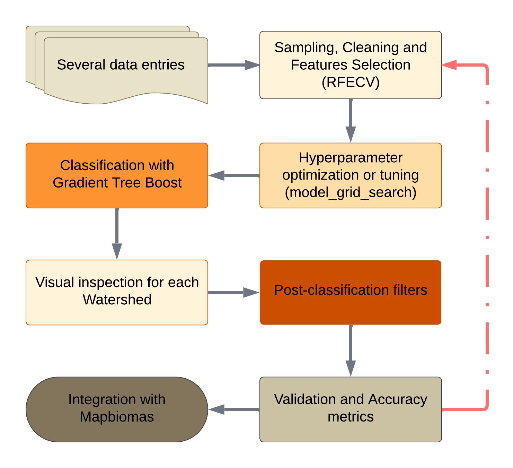
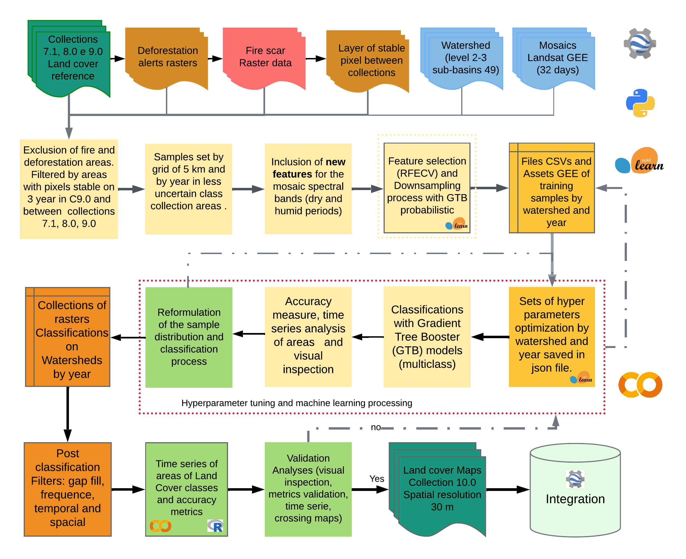

# Land Use and Land Cover Mapping Project - Caatinga Biome

This repository contains the complete workflow and scripts used for the annual mapping of land use and land cover in the Caatinga biome. The process is based on remote sensing techniques, utilizing the Google Earth Engine platform and Machine Learning algorithms to classify satellite imagery.

The project is divided into four main stages: sample collection, feature analysis and selection, hyperparameter tuning, and finally, classification.

## Methodological Flowchart

The diagram below illustrates the complete sequence of processes, from raw data collection to the generation of the final classified map.

  

  

## Workflow Stages

The workflow is organized into four major stages, each contained in its respective folder within the repository.

### 1. Sample Data Collection (`src/samples_process`)

The collection of sample data (ROIs - Regions of Interest) forms the foundation for training the models. To optimize the process over a large area like the Caatinga, the biome was divided into **756 grids**, which are based on **49 hydrographic regions**.

The collection areas are refined through a filter that uses four exclusion layers to ensure sample quality, removing areas with deforestation alerts, burn scars, and inconsistencies between different data collections. Finally, the data collected from the grids is consolidated and saved as assets organized by hydrographic basin and year.

**Relevant Scripts:**
* `colect_ROIs_fromGrade_with_Spectral_infoMB.py`
* `utils/merge_rois_from_Grade_Basin_to_bacias.py`

### 2. Feature Analysis and Variable Selection (`feature_process`)

In this stage, the objective is to identify which of the hundreds of calculated spectral bands and indices are most relevant for classification, avoiding redundancy and improving model performance.

We use a Recursive Feature Elimination with Cross-Validation (**REFCV**, implemented via `scikit-learn`) method to rank the most important variables. To mitigate high correlation among features, we apply a filter that analyzes the correlation matrix and removes less important variables that are strongly correlated with others. Additionally, a new process was implemented to reduce the size of the sample set by selecting the most reliable samples and discarding those that could introduce noise into the training.

**Relevant Scripts:**
* `featureselection_functionsV2.py`
* `Feature_Selection_ROIs_Col10.ipynb`
* `correction_class_samples_downsampled.py`

### 3. Hyperparameter Tuning (`tuningHiperparameters`)

To ensure the best possible classifier performance, we conduct a hyperparameter optimization (*tuning*) process. This script systematically tests various combinations of classifier parameters for each sample set (per basin and year). At the end of the process, the combination that yields the best accuracy is saved to be used in the classification stage.

**Relevant Scripts:**
* `hyperpTuning_Halving_Grid_Search.py`

### 4. Classification (`classification_process`)

This is the final stage, where the land use and land cover map is generated for each basin and year. The classification script is designed to load all the artifacts generated in the previous stages, which are saved in the `Dados/` folder:

* **Geographic boundaries** of the basin.
* A JSON file (`.json`) with the **list of selected features**.
* A JSON file (`.json`) with the **optimized hyperparameters** for the classifier.

Using these inputs, the script runs the trained model on the image mosaic for the corresponding year, generating the final classified map. A debugging notebook is available to review the process step-by-step.

**Relevant Scripts:**
* `classificacao_NotN_newBasin_Float_col10_probVC2.py`
* `debugar_classification_process.ipynb`